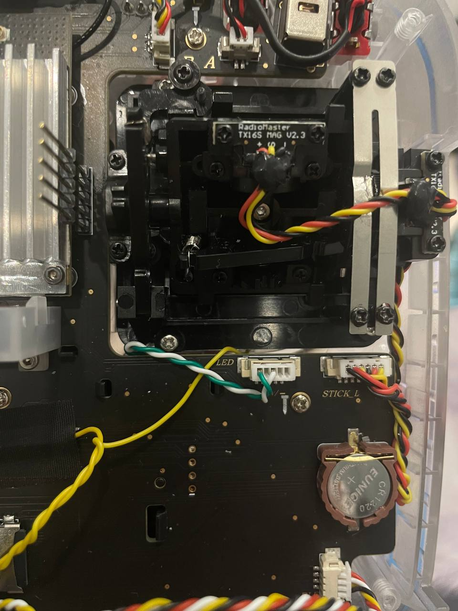

## Lua LED & VTX Switch

Скрипт для переключения каналов видеопередатчика и цвета светодиодов с экрана аппаратуры.

  

### Установка скрипта OpenTX

1) Скачать [zip-архив](https://github.com/alexeystn/lua-vtx-switch/archive/refs/heads/master.zip) и распаковать.
2) Скопировать содержимое папки `SCRIPTS/TOOLS` из архива в папку `SCRIPTS/TOOLS` на SD карте.
3) На аппаратуре открыть меню `TOOLS` (долгим нажатием кнопки `Menu`) и выбрать `LED & VTX setup`

<details>
  <summary> <i>Дополнительно</i> </summary>
  Для быстрого доступа к скрипту на экране телеметрии (не обязательно):
  
  1) Положить `ledvtx.lua` из папки `SCRIPTS/TELEMETRY` из архива в папку `SCRIPTS/TELEMETRY` на SD-карте.
  2) В настройках модели на странице `DISPLAY` выбрать `Script: ledvtx` для любого из экранов.  
</details>

### Настройка Betaflight

1) Настроить режим светодиодов `set ledstrip_profile = STATUS`

<details>
  <summary> <i>Рекомендуемые оттенки</i> </summary>
  
```
color 1 30,100,120
color 2 0,0,240
color 3 10,0,220
color 4 30,0,180
color 5 90,0,180
color 6 120,0,240
color 7 150,0,180
color 8 180,0,120
color 9 210,0,180
color 10 240,0,240
color 11 270,0,180
color 12 300,0,120
color 13 330,0,180
```
  
</details>

### Возможные проблемы

Если у вас меняется цвет только первого светодиода, измените в файле `SCRIPTS/TOOLS/ledvtx/ledcount.lua` параметр `ledCount = 1` на нужное количество диодов в ленте.


### Настройка аппаратуры

1) Перейти в `SYS MENU/HARDWARE(6/7)`
2) В поле `Serial port` выбрать `AUX1` = `LUA`

### Подключение Arduino Nano


1) Подключение ардуино осуществляется в порт BLE, от него же берет питание
2) RX BLE идет на ногу D2 arduino
3) TX BLE идет на ногу D3 arduino
4) Сигнальный с "колец" идет на ногу D4 arduino




### Печать проставок для стиков

[5mm_ring_V5.stl](3D%2F5mm_ring_V5.stl)
Подходит любой жесткий пластик, для левого/правого нужно отзеркалить, чтобы прорезь была снизу.
При печати белым получается более плавное рассеивание света, при прозрачным более аккуратный вид.

С подсветкой:


Без подсветки:


